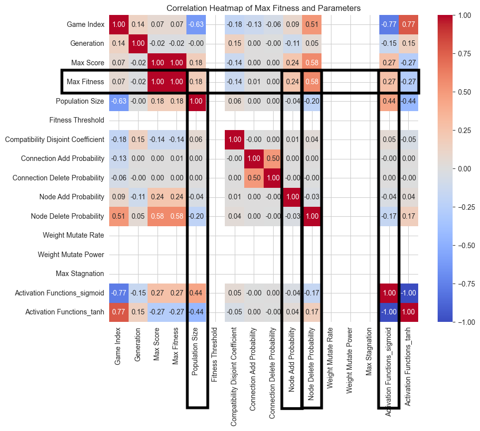

# Flappy Bird AI

## Overview
Welcome to the Flappy Bird AI repository! This project is a machine learning experiment that uses the NEAT (NeuroEvolution of Augmenting Topologies) algorithm to train a neural network to play the game Flappy Bird. The game is implemented in Python using the Pygame library.

## Project Architecture and Hierarchy
The project is structured as follows:
- `Games`: Contains the main game executable files.
- `Objects`: Includes the classes for game objects like the base, bird, and pipes.
- `imgs`: Holds all the image assets used in the game.
- `game_stats`: txt file which contains information about played games by ai
- `README.md`: The file you are reading now, which provides documentation for the project.

### Key Components:
- `Flappy_bird_OOP.py`: The main game class file using Object-Oriented Principles.
- `config.py`: Contains game settings.
- `neat_config.txt`: Contains NEAT algorithm settings.
- `functions.py`: Helper functions used across the game.
- `main.py`: The entry point of the game to start playing.

## Features
- Utilizes the NEAT algorithm for evolving neural networks to play the game autonomously.
- Implements a Pygame-based environment for visual representation of gameplay.
- Tracks and displays real-time statistics such as score and fitness levels.

## NEAT Algorithm Inputs
The NEAT (NeuroEvolution of Augmenting Topologies) algorithm is used to control the bird's movements in the game. The inputs to the neural network determine the bird's actions at each frame. The following inputs are provided to the NEAT algorithm:

1. `bird.y`: The bird's current y-coordinate.
2. `abs(bird.y - self.pipes[pipe_ind].height)`: The absolute difference between the bird's y-coordinate and the top pipe's height.
3. `abs(bird.y - self.pipes[pipe_ind].bottom)`: The absolute difference between the bird's y-coordinate and the bottom pipe's position.
4. `bird.vel`: The current vertical velocity of the bird.
5. `abs(bird.x - self.pipes[pipe_ind].x)`: The absolute difference between the bird's x-coordinate and the pipe's x-coordinate.

These inputs are processed by the neural network to output the decision of whether the bird should jump or not at each time step. The goal is for the AI to learn the optimal timing of jumps to navigate through the pipes without colliding.

### Understanding the Inputs:
- The `bird.y` input allows the neural network to consider the bird's vertical position.
- The vertical distances to the next pipes (`height` and `bottom`) help the AI gauge the gaps it needs to pass through.
- The `bird.vel` input is crucial for understanding the bird's current motion.
- The horizontal distance to the next pipe (`bird.x - pipe.x`) helps the AI predict when to jump to clear the pipe.

## Flappy Bird Game Analysis

I did some random games for different parameters and saved the results in a csv file. Then I analyzed the dataset to understand the relationships between various parameters and the Max Fitness value achieved in Flappy Bird games.

As we can see from the correlation matrix, the Max Fitness value is correlated with the Max Score and Population Size. It is also correlated with the Node Delete Probability and Node Add Probability, with the population size and activation function. 

!Correlation refers to the statistical relationship between two variables, where positive correlation indicates that as one variable increases, the other also tends to increase, while negative correlation suggests that as one variable increases, the other tends to decrease.

So as we can se some bigger positive or negative correlation values, we can say that these parameters are more important for the Max Fitness value.

Let's have a deep dive into the relationships between these parameters.

### Dataset Description
In this analysis, we examine the relationships between various parameters and the Max Fitness value achieved in Flappy Bird games. 

The dataset contains the following attributes:

1. **Game_Index**: Index of the game.
2. **Generation**: Generation of the game.
3. **Max_Score**: Maximum score achieved in the game.
4. **Max_Fitness**: Maximum fitness achieved in the game.
5. **Population_Size**: Size of the population.
6. **Hidden_Layers**: Number of hidden layers.
7. **Activation** Function: Activation function used.
8. **Node_Delete_Probability**: Probability of deleting a node.
9. **Node_Add_Probability**: Probability of adding a node.

